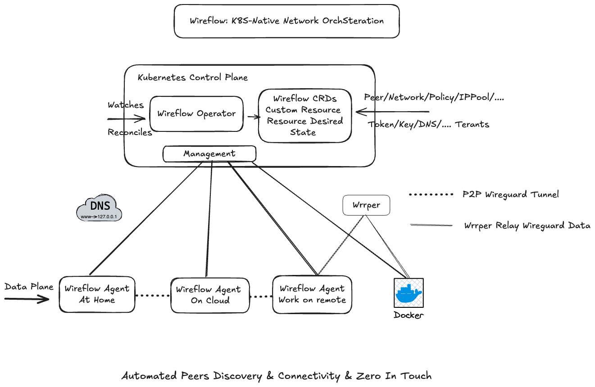

<div align="center">

# Lattice

**Cloud-Native WireGuard Network Orchestration**

[](LICENSE)
[](https://goreportcard.com/report/github.com/alatticeio/lattice)
[](https://github.com/alatticeio/lattice/releases/latest)
[](https://github.com/alatticeio/lattice/pkgs/container/lattice)
[](CONTRIBUTING.md)

Lattice simplifies the construction of encrypted overlay networks across multi-cloud, cross-datacenter, and edge environments — without touching firewalls or exposing public IPs.

[**Website**](https://lattice.run) · [**Documentation**](https://lattice.run/docs) · [**Issues**](https://github.com/alatticeio/lattice/issues)

</div>

---

## Overview

Lattice is a WireGuard management platform built for Kubernetes. It automates the full lifecycle of secure peer-to-peer tunnels:

- **Control Plane** — Kubernetes Operator that declaratively manages network topology via CRDs. Acts as the single source of truth for keys, IP allocation, and peer relationships.
- **Data Plane** — Lightweight agent deployed on each device. Establishes encrypted WireGuard tunnels with automatic NAT traversal (ICE/STUN/TURN), even across symmetric NATs.
- **Relay Plane** — Built-in WRRP relay server as fallback when direct P2P is not possible.

## Architecture



## Features

| Feature | Status |
|---------|--------|
| WireGuard tunnel automation (key distribution, rotation) | ✅ |
| Automatic NAT traversal (ICE / STUN / TURN) | ✅ |
| Built-in IPAM — conflict-free IP allocation per workspace | ✅ |
| CRD-based declarative network topology | ✅ |
| Network policy engine (allow/deny, ingress/egress, port-level) | ✅ |
| Multi-workspace & RBAC | ✅ |
| Web Dashboard | ✅ |
| All-in-One deployment (embedded NATS + SQLite, no external deps) | ✅ |
| Telemetry export (VictoriaMetrics push) | ✅ |
| Multi-region / multi-cloud bridging | 🔜 |
| Smart DNS (internal service naming) | 🔜 |

---

## Installation

### Homebrew (macOS / Linux)

```bash
brew tap alatticeio/tap
brew install lattice
```

### YUM (RHEL / CentOS / Rocky / Fedora)

Create `/etc/yum.repos.d/lattice.repo`:

```ini
[lattice]
name=Lattice
baseurl=https://alatticeio.github.io/lattice/rpm
enabled=1
gpgcheck=0
```

```bash
sudo yum install lattice
sudo systemctl enable --now lattice
```

### APT (Debian / Ubuntu)

```bash
curl -fsSL https://alatticeio.github.io/lattice/deb/Packages.gz -o /tmp/lattice-Packages.gz
echo "deb [trusted=yes] https://alatticeio.github.io/lattice/deb ./" | sudo tee /etc/apt/sources.list.d/lattice.list
sudo apt update
sudo apt install lattice
sudo systemctl enable --now lattice
```

### Docker

```bash
docker run -d \
  --name lattice \
  --restart unless-stopped \
  --privileged \
  --network host \
  ghcr.io/alatticeio/lattice:latest \
  up --signaling-url nats://<host>:4222 --token <token>
```

### Binary Download

Download pre-built binaries from [GitHub Releases](https://github.com/alatticeio/lattice/releases).

```bash
# Linux amd64
curl -sSL https://github.com/alatticeio/lattice/releases/latest/download/lattice_<version>_linux_amd64.tar.gz | tar xz
sudo mv lattice /usr/local/bin/
```

---

## Quick Start

Lattice's control plane runs on Kubernetes. The quickstart script handles cluster creation and deployment automatically.

```bash
curl -sSL https://raw.githubusercontent.com/alatticeio/lattice/master/hack/quickstart.sh | bash
```

The script will:
1. Verify Docker, k3d, and kubectl are present (installing missing tools automatically).
2. Check that ports **8080** (Dashboard / API) and **4222** (NATS signaling) are free.
3. Create a local k3d cluster and apply CRDs, RBAC, and Deployments.
4. Wait for the pod to become healthy.
5. Print a ready-to-use `lattice up` command with the NATS address and initial token.

**Existing cluster (kustomize):**

```bash
kubectl apply -k https://github.com/alatticeio/lattice/config/lattice/overlays/all-in-one
```

---

## Connecting an Agent

All management commands below use `--signaling-url` to reach the embedded NATS server (default port 4222).

### 1. Create a workspace

```bash
lattice workspace add dev \
  --display-name "Development" \
  --signaling-url nats://localhost:4222
```

```bash
# List all workspaces (shows namespace values used in subsequent commands)
lattice workspace list --signaling-url nats://localhost:4222
```

### 2. Create an enrollment token

```bash
lattice token create dev-team \
  -n <namespace> \
  --limit 10 \
  --expiry 168h \
  --signaling-url nats://localhost:4222
```

| Flag | Description |
|------|-------------|
| `-n` / `--namespace` | Workspace namespace (from `workspace list`) |
| `--limit` | Max agent connections (0 = unlimited) |
| `--expiry` | Token lifetime (e.g. `24h`, `168h`, omit = never) |

### 3. Start an agent

```bash
lattice up --signaling-url nats://localhost:4222 --token <token>
```

Run as a container:

```bash
docker run -d \
  --name wf-agent \
  --restart unless-stopped \
  --privileged \
  --network host \
  ghcr.io/alatticeio/lattice:latest \
  up --signaling-url nats://localhost:4222 --token <token>
```

### 4. Allow traffic between peers

Lattice enforces a **default-deny** policy — agents can establish tunnels but cannot exchange traffic until a policy explicitly permits it. This prevents accidental exposure in multi-tenant environments.

**CLI — allow all traffic in a workspace (development / single-tenant):**

```bash
lattice policy allow-all \
  -n <namespace> \
  --signaling-url nats://localhost:4222
```

**CLI — fine-grained policy:**

```bash
lattice policy add my-policy \
  -n <namespace> \
  --action ALLOW \
  --desc "allow all peer traffic" \
  --signaling-url nats://localhost:4222
```

**Dashboard — visual policy editor:**

Navigate to `http://localhost:8080` → **Policies** → **Create Policy**.

You can define rules scoped to specific peers (by label), ports, and direction (ingress / egress).

**kubectl — apply a policy CRD directly:**

```yaml
apiVersion: alattice.io/v1alpha1
kind: LatticePolicy
metadata:
  name: allow-all
  namespace: default
  labels:
    action: ALLOW
  annotations:
    description: "Full mesh — allow all peer traffic"
    policyTypes: "Ingress,Egress"
spec:
  action: ALLOW
  peerSelector: {}   # matches all peers in the namespace
  ingress: []        # empty = no port restriction
  egress: []
```

```bash
kubectl apply -f policy-allow-all.yaml
```

### 5. Verify connectivity

Check the local agent status and peer list:

```bash
lattice status
```

Example output:

```
Interface : wg0
Address   : 10.100.0.1/24
Public Key: abc123...=
Port      : 51820

Peers: 2 total, 2 connected

  Peer      : xyz456...=
  Address   : 10.100.0.2/32
  Endpoint  : 203.0.113.5:51820
  Handshake : 8 seconds ago
  Traffic   : ↑ 1.2 MB  ↓ 3.4 MB
  Status    : connected

  Peer      : def789...=
  Address   : 10.100.0.3/32
  Endpoint  : 198.51.100.7:51820
  Handshake : 22 seconds ago
  Traffic   : ↑ 0.5 MB  ↓ 2.1 MB
  Status    : connected
```

**Ping between nodes to confirm the tunnel is working:**

On **Node A** (address `10.100.0.1`), ping Node B:

```bash
ping 10.100.0.2
```

Expected output when the tunnel is up:

```
PING 10.100.0.2 (10.100.0.2): 56 data bytes
64 bytes from 10.100.0.2: icmp_seq=0 ttl=64 time=4.3 ms
64 bytes from 10.100.0.2: icmp_seq=1 ttl=64 time=3.8 ms
```

If ping times out, the tunnel has not been established. Common causes:
- The policy is still default-deny — run `lattice policy allow-all -n <namespace>` to permit traffic.
- The peer has not yet completed a WireGuard handshake — check `lattice status` on both nodes and wait a few seconds.
- A firewall is blocking UDP on port 51820 — Lattice will attempt TURN relay fallback automatically.

---

### 6. Clean up resources

Remove a specific agent from the workspace:

```bash
lattice token remove <token>
```

Delete a workspace and all its peers:

```bash
lattice workspace remove <namespace> --signaling-url nats://localhost:4222
```

Remove a policy:

```bash
lattice policy remove <name> -n <namespace> --signaling-url nats://localhost:4222
```

Uninstall the control plane from Kubernetes:

```bash
kubectl delete -k https://github.com/alatticeio/lattice/config/lattice/overlays/all-in-one
```

---

## CLI Reference

All commands accept `--signaling-url nats://<host>:4222` to target the control plane.

### Agent

```bash
lattice up     --token <token> --signaling-url <url>
lattice status
```

### Workspace

```bash
lattice workspace add <slug> [--display-name <name>] [-n <namespace>]
lattice workspace list
lattice workspace remove <namespace>
```

### Token

```bash
lattice token create <name> [-n <namespace>] [--limit <n>] [--expiry <duration>]
lattice token list  [-n <namespace>]
lattice token remove <token>
```

### Policy

```bash
lattice policy allow-all -n <namespace>
lattice policy add <name>  -n <namespace> [--action ALLOW|DENY] [--desc <text>]
lattice policy list  -n <namespace>
lattice policy remove <name> -n <namespace>
```

---

## Configuration Reference

The control plane is configured via a YAML file (default: `/etc/lattice/lattice.yaml`):

```yaml
app:
  listen: :8080
  name: "Lattice"
  env: "production"
  init_admins:
    - username: "admin"
      password: "changeme"        # ⚠ Change before deploying

jwt:
  secret: "replace-with-random-secret"   # ⚠ Use a 32-byte random value
  expire_hours: 24

signaling-url: "nats://localhost:4222"   # Embedded NATS in all-in-one mode

database:
  dsn: "data/lattice.db"                # SQLite (all-in-one)
  # dsn: "root:pass@tcp(mariadb:3306)/lattice?charset=utf8mb4&parseTime=True"  # MariaDB
```

---

## Development

### Requirements

- Go 1.24+
- Docker 20.10+
- k3d 5.x+ (for local cluster)
- kubectl 1.20+

### Build from source

```bash
git clone https://github.com/alatticeio/lattice.git
cd lattice
make build-all
```

---

## Contributing

Contributions are welcome. Please read [CONTRIBUTING.md](CONTRIBUTING.md) before submitting a pull request.

<a href="https://github.com/alatticeio/lattice/graphs/contributors">
  
</a>

---

## Disclaimer

This tool is intended for legitimate technical research, enterprise private networking, and compliant remote access scenarios only. Users are responsible for ensuring their use complies with all applicable local laws and regulations. The authors assume no liability for any misuse of this software.

## License

[Apache License 2.0](LICENSE)
